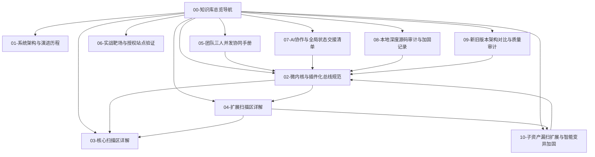

# 🧭 DAS-SentinelAgent (安恒星巡) 知识库总览与导航面板

> [!NOTE]
> 本知识库专为 **DAS-SentinelAgent (安恒星巡智能巡检与漏扫系统)** 打造，采用 **Obsidian 双链体系** 构建。全面记录了从单体脚本到十版全面升级、再到三人并发微内核插件化解耦的完整演进全貌、模块状态与开发规范。



---

## 📚 知识库核心导航目录

| 编号 | 文档名称 | 核心主题 | 当前运行状态 | 关联双链 |
| :---: | :--- | :--- | :---: | :--- |
| **00** | [[00-🧭_项目总览与知识库导航]] | 知识库主页、全局索引与总控面板 | 🟢 **ACTIVE** | `[[00-🧭_项目总览与知识库导航]]` |
| **01** | [[01-🏛️_系统总体架构与演进历程]] | 项目背景、从单脚本到十版升级历史、三人团队并发解耦重构 | 🟢 **ACTIVE** | `[[01-🏛️_系统总体架构与演进历程]]` |
| **02** | [[02-🧩_微内核与插件化总线规范]] | `ScanContext` 数据总线、`BaseScanner` 接口、`ScannerRegistry` 递归自动发现 | 🟢 **ACTIVE** | `[[02-🧩_微内核与插件化总线规范]]` |
| **03** | [[03-🎯_核心扫描区详解(scanner_core)]] | 常规高危漏洞扫描探针、网页防篡改、多模态敏感隐私信息与 SRC 过滤基准 | 🟢 **ACTIVE** | `[[03-🎯_核心扫描区详解(scanner_core)]]` |
| **04** | [[04-🌐_扩展扫描区详解(scanner_extensions)]] | 子资产测绘、漏洞利用链、特殊链接与深度路由提取、API 接口模糊探针 | 🟢 **ACTIVE** | `[[04-🌐_扩展扫描区详解(scanner_extensions)]]` |
| **05** | [[05-👥_团队三人并发协同与开发手册]] | 前端/后端/插件研发分工指引、新插件开发五步法、防代码冲突规范 | 🟢 **ACTIVE** | `[[05-👥_团队三人并发协同与开发手册]]` |
| **06** | [[06-🔍_实战靶场与授权站点验证记录]] | 九号公司 (`ninebot.com`) 辅助验证、`127.0.0.1:8088` 工业级靶场全量回归用例 | 🟢 **21/21 PASSED** | `[[06-🔍_实战靶场与授权站点验证记录]]` |
| **07** | [[07-🤖_AI协作与全局区域状态交接清单(AI_Handover)]] | **★ 关键交接清单**：全局模块状态、各区边界、扩展区接入核心规范 | 🟢 **ACTIVE** | `[[07-🤖_AI协作与全局区域状态交接清单(AI_Handover)]]` |
| **08** | [[08-🛡️_本地深度源码审计与缺陷加固记录(Code_Audit)]] | **★ 源码审计报告**：排查并修复 7 大核心漏洞/缺陷，全量本地验证记录 | 🟢 **25/25 PASSED** | `[[08-🛡️_本地深度源码审计与缺陷加固记录(Code_Audit)]]` |
| **09** | [[09-⚖️_新旧版本架构深度对比与质量审计(Version_Comparison)]] | **★ 版本对比与质量审计**：HYC12121/main 融合成果评测、优缺点与安全边界 | 🟢 **47/47 VERIFIED** | `[[09-⚖️_新旧版本架构深度对比与质量审计(Version_Comparison)]]` |
| **10** | [[10-🛰️_子资产漏扫扩展与智能变异加固总结(SubAsset_Expansion)]] | **★ 子资产与变异加固**：端口扫描、服务探针、证书审计、AI 绕过与基线对比 | 🟢 **70/70 PASSED** | `[[10-🛰️_子资产漏扫扩展与智能变异加固总结(SubAsset_Expansion)]]` |

---

## 🏢 核心目录与团队映射速查

```text
📁 DAS_SentinelAgent/
├── 📁 frontend/                     -> 🎨 前端团队 [状态: 运行正常] (Vue/React, CSS, HTML, Dashboard)
├── 📁 backend/                      -> ⚙️ 后端团队 [状态: 运行正常] (FastAPI, 任务状态机, DB, Orchestrator 微内核)
├── 📁 plugins/                      -> 🛡️ 安全研发团队 [状态: 深度解耦接入]
│   ├── 📁 core/                     -> 插件通信基座 (Registry, ScanContext, Filter, Scoping)
│   ├── 📁 scanner_core/             -> 🎯 核心漏扫区 (Vuln, Tamper, Sensitive)
│   └── 📁 scanner_extensions/       -> 🌐 漏扫扩展区 (已按方向细分，无缝接入核心调度流)
│       ├── 📁 sub_assets/           -> ① 资产与子域名测绘方向 (爬虫/子域/架构指纹)
│       ├── 📁 exploit_chain/        -> ② 漏洞利用链与深度渗透方向 (利用链推演)
│       ├── 📁 link_processor/       -> ③ 特殊链接提取与外链清洗方向 (动态JS路由挖掘)
│       └── 📁 api_fuzzer/           -> ④ REST API 接口模糊探测方向 (Swagger/API探针)
├── 📁 scripts/                      -> 🛠️ 辅助运维与调试脚本工具箱 (12个独立脚本集中收纳)
├── 📁 tests/                        -> 🧪 自动化测试套件 [状态: 21项测试 100% 通过]
└── 📁 obsidian/                     -> 📖 Obsidian 双链体系完整知识库 (8篇全景笔记)
```

> [!TIP]
> 推荐阅读顺序：[[01-🏛️_系统总体架构与演进历程]] -> [[02-🧩_微内核与插件化总线规范]] -> [[07-🤖_AI协作与全局区域状态交接清单(AI_Handover)]]
