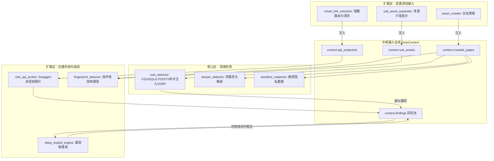

# 🌐 扩展扫描区详解 (`plugins/scanner_extensions`)

> [!IMPORTANT]
> **核心连接准则**：
> **扩展扫描区绝非孤立存在的外挂脚本，而是全流程深度接入核心扫描调度流水线的“第一级情报源”与“深层利用验证器”**。
> 所有扩展模块通过继承 `BaseScanner`、读写 `ScanContext` 数据总线，并在 `ScannerRegistry` 注册后由 `InspectionOrchestrator` 统一指挥调度。



---

## 1. 扩展区域四位一体方向细分结构

```text
plugins/scanner_extensions/
├── sub_assets/          # [状态: ACTIVE / 已验证] 方向 1：资产拓扑与子域名测绘方向
│   ├── asset_crawler.py        -> 异步全站页面与资源爬虫 (含二级递归联动)
│   ├── sub_asset_expander.py   -> 多源子域拓扑与 CNAME 接管检测
│   ├── fingerprint_detector.py -> 技术栈架构拓扑指纹识别
│   ├── port_scanner.py         -> 异步 TCP Connect 扫描 (Top 100 端口) + Banner 抓取
│   ├── vuln_scanner.py         -> Redis/MongoDB/Docker/Actuator/FTP 服务级漏洞探针
│   ├── asset_correlator.py     -> IP 聚合、C 段关联、多维加权风险评分
│   ├── cert_auditor.py         -> HTTPS 证书过期/弱加密套件/弱 TLS 协议审计
│   └── whois_enricher.py       -> WHOIS/ASN/地理位置与网络运营商情报测绘
├── exploit_chain/       # [状态: ACTIVE / 已验证] 方向 2：漏洞利用链与深度渗透方向
│   ├── deep_exploit_engine.py  -> SQLi/LFI/SSTI/BOLA 专项深化推演
│   └── ai_mutator.py           -> 恒脑大模型自适应 Payload 变异与 WAF 绕过
├── link_processor/      # [状态: ACTIVE / 已验证] 方向 3：特殊链接与外链清洗方向
│   └── smart_link_extractor.py -> 动态 JS 路由提取与合规外链清洗
└── api_fuzzer/          # [状态: ACTIVE / 已验证] 方向 4：API 接口挖掘与模糊探测方向
    └── rest_api_prober.py      -> Swagger/OpenAPI/Actuator 接口探针与真实绕过验证
```

---

## 2. 方向一：`sub_assets/` (资产与子域拓扑测绘)

### 模块矩阵与运行状态：
1. **`asset_crawler.py`** `[状态: 运行正常 / 已集成]`：
   - 采用 `aiohttp` 异步高并发广度优先 (BFS) 遍历；
   - 自动提取页面链接、JS 脚本资源、API 端点，并进行域名白名单合规过滤；
   - **接入核心**：向 `ScanContext` 写入 `context.crawled_pages`, `context.static_assets`, `context.external_links`，为核心漏扫区提供弹药。
2. **`sub_asset_expander.py`** `[状态: 运行正常 / 6项单测全绿]`：
   - **多源情报提取**：被动 HTML/JS/CSP 正则提取 + 证书透明度日志 (`crt.sh`) + 高价值字典爆破；
   - **安全风险识别**：CNAME 悬挂/子域名接管检测 (`GitHub Pages`, `AWS S3 Bucket` 等) + 开放目录列表 (`Index of /`) 识别；
   - **角色自动分类**：将子域名自动分类为 `AUTH_SSO` (身份网关)、`API_GATEWAY` (微服务接口)、`ADMIN_PORTAL` (后台管理)、`DEV_TEST` (测试环境)；
   - **接入核心**：向 `ScanContext` 写入 `context.sub_assets`，被后续指纹分析器与漏洞扫描器消费。
3. **`fingerprint_detector.py`** `[状态: 运行正常 / 已集成]`：
   - 智能识别目标架构层级：前端框架 (Vue/React/Angular)、Web 容器 (Nginx/Apache)、后端语言 (Spring/PHP/Python)、安全防护 (Cloudflare/Aliyun WAF)。

---

## 3. 方向二：`exploit_chain/` (漏洞利用链与深度渗透)

**`deep_exploit_engine.py`** `[状态: 运行正常 / 已集成]`：
- 在常规漏洞扫描发现疑似隐患后，自动启动专项深入利用推演；
- **非破坏性验证**：不进行数据删改，只通过差分与回显特征验证利用链可行性；
- **接入核心**：读取 `context.findings` 中核心区扫描出的漏洞，补充证据链并回写 `context.findings`，实现漏洞证据链闭环。

---

## 4. 方向三：`link_processor/` (特殊链接提取与清洗)

**`smart_link_extractor.py`** `[状态: 运行正常 / 已集成]`：
- 专门应对前后端分离单页面应用 (SPA) 与动态前端路由；
- 从 JS 打包混淆代码中还原 `/api/v1/...` 隐藏接口路由；
- **接入核心**：输出结构化端点集合至 `context.api_endpoints`，供核心漏洞扫描与 API 探针直接调用。

---

## 5. 方向四：`api_fuzzer/` (API 接口安全探针)

**`rest_api_prober.py`** `[状态: 运行正常 / 已集成]`：
- 针对已发现的 API 路由执行轻量级安全模糊探测；
- 自动化嗅探未授权开放的 `swagger-ui.html`, `api-docs`, `actuator/health` 等敏感管理端点；
- **接入核心**：输出高危 API 暴露发现直接灌入 `context.findings`，统一进入 SRC 过滤与报告生成流。

---

## 6. 未来扩展方向接入规范 (How Future Directions Plug In)

后续团队若需新增任意新方向（如端口扫描、弱口令、PoC 联动），只需在 `plugins/scanner_extensions/` 下新建对应文件夹：
- 📂 `plugins/scanner_extensions/port_scanner/` (端口与服务识别方向)
- 📂 `plugins/scanner_extensions/auth_bypass/` (越权与弱口令字典探测方向)
- 📂 `plugins/scanner_extensions/nuclei_runner/` (开源 PoC 引擎联动方向)

### 接入核心的三大要素：
1. **类继承**：必须继承 `from plugins.core.base import BaseScanner`；
2. **方法实现**：必须实现 `async def run(self, context: ScanContext) -> None`；
3. **数据流转**：从 `context` 读取需要的数据，将探测成果写入 `context.add_findings(...)` 或其他属性中。

---

## 7. 导航与关联
- 查看 AI 全局状态清单：[[07-🤖_AI协作与全局区域状态交接清单(AI_Handover)]]
- 查看微内核数据总线：[[02-🧩_微内核与插件化总线规范]]
- 查看核心漏扫区：[[03-🎯_核心扫描区详解(scanner_core)]]
