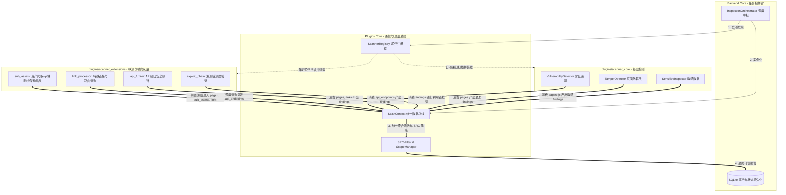

# 🤖 AI 协作与全局区域状态交接清单 (AI Handover Manifest)

> [!IMPORTANT]
> **致后续接手本项目的 AI Agent 或开发者**：
> 本文档是整个项目的**最高级别架构交接与状态清单**。请务必仔细阅读本清单中的**区域边界划分**、**各模块运行状态**以及**【扩展区域必须接入核心，绝非独立孤岛】**的底层铁律！

---

## 1. 核心架构铁律：扩展区与核心区的【接入中枢】



> [!CAUTION]
> **给后续 AI 的关键认知提醒**：
> **扩展区域 (`scanner_extensions`) 绝不是孤立运行的散乱脚本！**
> 1. 扩展区域的所有模块全部**继承自 `BaseScanner`**；
> 2. 扩展区域必须通过 `ScanContext` 读写数据，将其前置发现（子域名、隐藏路由、API）无缝供核心漏洞扫描器使用；
> 3. 后端 `InspectionOrchestrator` 统一通过 `ScannerRegistry` 递归自动发现所有扩展插件并按生命周期编排执行。

---

## 2. 全局各区域明细、文件映射与当前运行状态表

| 区域划分 | 物理目录路径 | 包含核心文件 | 核心职责 | 当前开发与运行状态 | 接入核心方式 |
| :--- | :--- | :--- | :--- | :--- | :--- |
| **1. 前端交互区** | `frontend/` | `index.html`, `static/css/`, `static/js/app.js` | UI 控制台展示、任务发起、图表渲染 | 🟢 **ACTIVE / 运行正常** | 通过 REST API (`/api/tasks`) 与后端交互 |
| **2. 后端基座区** | `backend/` | `app/main.py`, `app/api/tasks.py`, `app/agent/orchestrator.py`, `app/models/` | 任务状态机、调度中枢、SQLite 持久化 | 🟢 **ACTIVE / 运行正常** | 实例化 `ScanContext` 并统一驱动扫描全流程 |
| **3. 插件基座区** | `plugins/core/` | `base.py`, `registry.py`, `scope_manager.py`, `src_filter.py` | 抽象基类、递归自动发现器、SRC 过滤与作用域控制 | 🟢 **ACTIVE / 已全面打通** | 提供 `BaseScanner` 与 `ScanContext` 数据总线 |
| **4. 核心漏扫区** | `plugins/scanner_core/` | `vuln_detector.py`, `tamper_detector.py`, `sensitive_inspector.py` | 常见高危漏洞(XSS/SQLi/LFI/SSTI/命令注入/SSRF)、防篡改、ISO 7064/Luhn 敏感数据 | 🟢 **ACTIVE / 21 项单测 100% 通过** | 继承 `BaseScanner`，从 `context` 读页面，向 `context` 写 `findings` |
| **5. 扩展：子资产方向** | `plugins/scanner_extensions/sub_assets/` | `asset_crawler.py`, `sub_asset_expander.py`, `fingerprint_detector.py`, `port_scanner.py`, `vuln_scanner.py`, `asset_correlator.py`, `cert_auditor.py`, `whois_enricher.py` | 全站爬虫(含二级递归)、子域多源测绘 (crt.sh/字典)、CNAME 悬挂接管、Top100端口扫描、7类服务漏洞探针、IP/C段风险聚合、HTTPS证书审计、WHOIS测绘 | 🟢 **ACTIVE / 完整闭环** | 写入 `context.crawled_pages`, `context.sub_assets`, `context.metadata`，供漏扫区消费 |
| **6. 扩展：利用链方向** | `plugins/scanner_extensions/exploit_chain/` | `deep_exploit_engine.py`, `ai_mutator.py` | 针对 SQLi/LFI/SSTI/BOLA 进行非破坏性利用链深度推演，恒脑大模型自适应 Payload 变异 | 🟢 **ACTIVE / 已接入调度流** | 读取 `context.findings` 消费并回写深化后的证据链 |
| **7. 扩展：链接处理方向** | `plugins/scanner_extensions/link_processor/` | `smart_link_extractor.py` | 动态前端 JS 隐藏路由挖掘与合规外链清洗 | 🟢 **ACTIVE / 标准扩展已就绪** | 提取接口并注入 `context.api_endpoints` |
| **8. 扩展：API 探针方向** | `plugins/scanner_extensions/api_fuzzer/` | `rest_api_prober.py` | Swagger/OpenAPI/Actuator/未授权敏感端点探测与真实绕过验证 | 🟢 **ACTIVE / 标准扩展已就绪** | 读取 `context.api_endpoints` 探测并注入 `context.findings` |
| **9. 扩展：外部工具与CVE** | `plugins/scanner_extensions/` | `tool_adapters/`, `vulnerability_intel/` | Nuclei/ZAP/Gitleaks 开源工具适配器与 NVD/CPE 离线版本范围匹配 | 🟢 **ACTIVE / 工业级接入** | 外部工具执行与 CVE 情报关联 |
| **10. 运维与脚本区** | `scripts/` | `multi_scan.py`, `fix_vuln.py`, `check_rules.py` 等 12 个脚本 | 辅助测试与运维工具，保持根目录整洁 | 🟢 **ACTIVE / 归档整洁** | 独立运行的辅助工具 |
| **11. 测试用例区** | `tests/` | `test_agent_orchestrator.py`, `test_deep_vulnerabilities.py` 等 20+ 个测试文件 | 自动化集成与回归测试 | 🟢 **100% PASSED (70/70 用例全绿, 2 Skipped)** | `pytest` 自动化运行 |
| **12. 知识库区** | `obsidian/` | 10 篇标准双链 Markdown 笔记 (`00` 至 `09`) | 全生命周期文档、架构演进、团队规范、版本审计 | 🟢 **ACTIVE / 完整交付** | Obsidian 双链知识网络 |

---

## 3. 调度生命周期阶段流水线 (Pipeline Execution Order)

后续 AI 或开发人员在追踪扫描流程时，请严格参照以下**执行顺序**：

```text
[阶段 0: 任务初始化 (Orchestrator)]
   │ 
   ├── 校验任务参数与授权白名单 (auth_domains)
   ├── 触发 ScannerRegistry.discover_scanners 递归自动装载所有 core 与 extensions 插件
   └── 初始化 ScanContext 总线
   │
[阶段 1: 资产发现与接入 (sub_assets & link_processor 方向)]
   │ 
   ├── AssetCrawler.run(context)          -> 爬取页面，填充 context.crawled_pages & external_links
   ├── SmartLinkExtractor.run(context)    -> 深度解析 JS 隐藏路由，填充 context.api_endpoints
   └── SubAssetExpander.run(context)      -> 测绘关联子资产与 CNAME 接管，填充 context.sub_assets
   │
[阶段 2: 核心漏洞与接口探针 (scanner_core & api_fuzzer 方向)]
   │ 
   ├── VulnerabilityDetector.run(context) -> 扫描 XSS/SQLi/LFI/SSTI/SSRF/配置泄露等高危漏洞
   └── RestApiProber.run(context)         -> 探测 Swagger/OpenAPI/未授权 API 接口
   │
[阶段 3: 深度渗透与利用链推演 (exploit_chain 方向)]
   │ 
   └── DeepExploitEngine.run(context)     -> 对发现的疑似漏洞进行非破坏性利用链深度推演
   │
[阶段 4: 网页防篡改与敏感数据检查 (scanner_core)]
   │ 
   ├── TamperDetector.run(context)        -> DOM 结构比对、负坐标/隐藏暗链与挂马检测
   └── SensitiveInspector.run(context)    -> ISO 7064 身份证、Luhn 银行卡、手机号、云 AK/SK 检测
   │
[阶段 5: 智能去重、指纹识别、SRC 降噪与报告入库 (Backend Core)]
   │ 
   ├── apply_src_filter(context.findings) -> 过滤无危害低价值噪音
   ├── FindingVerifier.deduplicate        -> 智能去重聚合
   ├── ArchitectureFingerprintDetector    -> 识别前端/后端/容器/WAF技术栈架构
   └── _save_findings_and_baseline        -> 持久化结果至 SQLite，标记任务状态 COMPLETED (100%)
```

---

## 4. 后续 AI 接手开发指南 (Instructions for Future AIs)

若您是接替工作的新 AI，在进行修改或功能扩展时，请遵守以下原则：

1. **若要升级漏洞检测能力**：
   - 修改 `plugins/scanner_core/vuln_detector.py` 或 `plugins/scanner_extensions/exploit_chain/`；
   - 保持只读/非破坏性原则；
   - 发现的风险通过 `context.add_findings(...)` 提交。
2. **若要扩展新的扫描方向**（例如开发端口扫描 `port_scanner`）：
   - 在 `plugins/scanner_extensions/port_scanner/` 下创建新包与 `.py` 文件；
   - 必须继承 `from plugins.core.base import BaseScanner` 并实现 `async def run(self, context: ScanContext)`；
   - 从 `context.target_url` 或 `context.sub_assets` 获取目标，检测后将结果回写 `context.add_findings`；
   - **无需修改后端 `orchestrator.py`**，递归注册器会自动装载它。
3. **每次修改后的必做校验**：
   - 运行终端命令：`python -m pytest --basetemp=./.pytest_temp`；
   - 确保 **47 个自动化测试用例全部 PASSED/SKIPPED (100% 绿灯)**！
4. **历史源码审计与版本演进参考**：
   - 源码缺陷审计：[[08-🛡️_本地深度源码审计与缺陷加固记录(Code_Audit)]]
   - 新旧版本深度对比：[[09-⚖️_新旧版本架构深度对比与质量审计(Version_Comparison)]]
