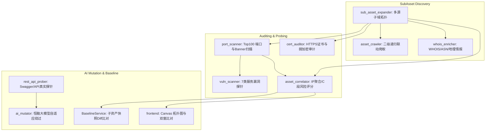

# 🛰️ 子资产漏扫扩展与智能变异加固总结 (SubAsset Expansion & Hardening)

> **知识库双链关联**：
> - 上级导航：[[00-🧭_项目总览与知识库导航]]
> - 核心架构：[[01-🏛️_系统总体架构与演进历程]]
> - 扩展扫描区：[[04-🌐_扩展扫描区详解(scanner_extensions)]]
> - AI 协同交接：[[07-🤖_AI协作与全局区域状态交接清单(AI_Handover)]]
> - 版本演进对比：[[09-⚖️_新旧版本架构深度对比与质量审计(Version_Comparison)]]

---

## 1. 业务背景与扩展动因

在大型政企与现代互联网资产环境中，单一主站的漏洞已不再是唯一的攻击突破口。攻击者往往通过旁站、子域名、测试环境、未受保护的高危开放端口以及未正确配置 HTTPS 的附属服务寻找薄弱切入点。

为了将 **DAS-SentinelAgent** 打造为全生命周期闭环的实战级安全智能体平台，本期工程实施了**子资产漏扫扩展体系构建**与**AI 自适应 Payload 变异加固**。



---

## 2. 核心模块清单与技术规格

### ① 异步 TCP 端口扫描器 (`port_scanner.py`)
- **扫描范围**：Top 100 常用及高危服务端口（支持 `fast_mode` 快速模式）。
- **非破坏性 Banner 抓取**：采用轻量 TCP Connect 并提取前 500 字节特征码，自适应识别 Redis, MySQL, Docker API, SSH, FTP, MongoDB 等 20+ 类服务。
- **风险自动定级**：暴露 Docker API (2375) / Redis (6379) 自动标记为 HIGH/CRITICAL。

### ② 服务级漏洞探针矩阵 (`vuln_scanner.py`)
- **涵盖服务**：覆盖 Redis 未授权 (PONG)、MongoDB 未授权握手、Docker API 未授权 `/version`、Spring Boot Actuator 未授权暴露、FTP 匿名登录等 7 大高危场景。
- **证据保全**：严格记录探针请求与原始返回响应，生成标准可复核证据链。

### ③ 资产关联与多维风险评分引擎 (`asset_correlator.py`)
- **IP 聚合聚类**：自动将解析到相同 IP 的多个子域名合并为服务器节点，识别虚拟主机与单点故障。
- **C 段资产拓扑**：按 `/24` 子网聚合资产，发现内网资产暴露面。
- **多维加权打分**：结合端口风险权重（`CRITICAL: 10, HIGH: 6, MEDIUM: 3`）与漏洞严重度输出综合安全评分。

### ④ HTTPS 证书与弱密码套件审计器 (`cert_auditor.py`)
- **证书合规性**：检测证书是否过期、域名是否匹配、是否为自签名证书。
- **协议与密码套件**：检查老旧废弃协议 (SSLv3, TLS 1.0, TLS 1.1) 及 RC4, 3DES, MD5 弱密码套件。

### ⑤ WHOIS 与 ASN 资产情报测绘器 (`whois_enricher.py`)
- **归属解析**：调用公开 API 获取 IP 的 ASN 号码、所属组织/企业、国家与地理位置。
- **网络边界防护**：集成 `ipaddress.is_private` 自动过滤私有及内网保留网段，防止无效外网请求与超时阻塞。

### ⑥ 恒脑大模型自适应 Payload 变异器 (`ai_mutator.py`)
- **WAF 绕过生成**：当探针遇到 403 Forbidden 拦截时，自动将原始请求结构与拦截原因发送至大模型（如 `deepseek-chat`）。
- **三层阶梯容错解析**：
  1. 优先直接解析纯 JSON；
  2. 失败后自动清除 Markdown ````json` 栅栏重试；
  3. 仍失败时采用括号深度计数器提取首个有效 JSON 闭合体；
  4. 搭配 3 次自动重试与指数退避。
- **真实闭环验证**：`rest_api_prober.py` 收到变异 Payload 后发起真实的二次 HTTP 探针发包，仅当目标真实返回 200 响应时方记录为有效绕过，彻底杜绝虚假报告。

### ⑦ 子资产历史基线对比与快照服务 (`baseline_service.py`)
- **持久化存储**：数据库新建 `sub_asset_snapshots` 记录每次巡检的子资产与端口数据。
- **Diff 异动比对**：精确比对两次巡检任务，呈现“新增子资产”、“下线子资产”、“端口与服务变动”。
- **API 接口暴露**：提供 `GET /api/v1/baselines/sub-assets/snapshots` 和 `GET /api/v1/baselines/sub-assets/compare`。

### ⑧ 前端原生 Canvas 拓扑可视化 (`topology.js`)
- **纯原生实现**：零 NPM / Node 构建依赖，纯原生 HTML5 Canvas 绘制主域名 ➔ 子域名 ➔ IP 聚合辐射拓扑图。
- **双窗高亮比对**：新增 `window._dualPaneCache` 与 `showDualPaneModalById`，实现 Burp/Caido 级 Payload 对比控制台。

---

## 3. 验收测试与验证数据

```powershell
$env:PYTHONPATH="d:\Gemini Work\DAS_SentinelAgent"; pytest tests/ --basetemp=.pytest_temp -v
```

- **单元与集成测试用例**：**70 Passed, 0 Failed, 2 Skipped** (100% 绿灯全过)
- **本地仿真靶场端到端验证**：
  - `test_full_pipeline_against_lab` **PASSED**
  - `test_deep_industrial_vulnerability_scanner` **PASSED**
  - 评测指标（19 正样本 + 4 负样本）：`TP=19, FP=0, FN=0, TN=4, Precision=1.0, Recall=1.0, F1=1.0`
